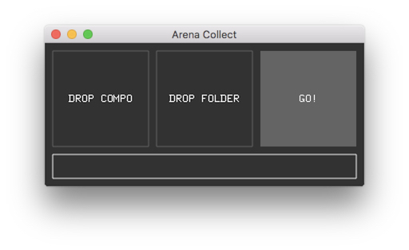

Arena Collect

It collects all the files involved in a composition of Resolume and copies them to a folder, also generates a new composition with the new paths of these files.

1) Drop the composition file in the "DROP COMPO" area.
2) Drop the destination folder in the "DROP FOLDER" area.
3) Click go and wait.

The software creates a new composition called COMPO_NAME_collect.avc, and a "sources" folder with all the files.

Made with http://openframeworks.cc
Works on : macOs and Windows

MacOs : https://github.com/armdz/ArenaCollect/releases/download/v1.0/ArenaCollect_osx.zip

http://armdz.com

